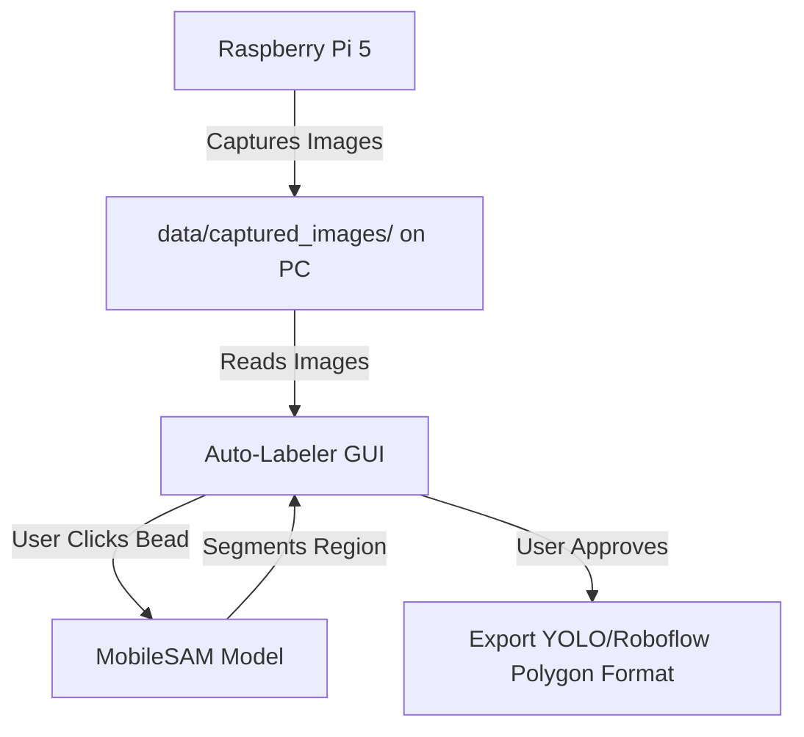

# Implementation Plan: Standalone Weld Auto-Labeler GUI

We will build a completely separate desktop application on your PC to handle the image segmentation and auto-labeling using **MobileSAM** (Segment Anything Model). This keeps the Raspberry Pi's capture code clean and free of heavy AI dependencies.

## User Review Required

> [!IMPORTANT]
> **MobileSAM Dependencies:** The auto-labeler will run on your PC and requires PyTorch and the MobileSAM weights file. We will automate the download of the model weights (`mobile_sam.pt` ~39MB) when the script is run for the first time.

## Proposed Architecture

The app will be built as a standalone Python file (`auto_labeler.py`) in your project folder, utilizing:
- **CustomTkinter / Tkinter:** For a clean, modern GUI.
- **PyTorch & MobileSAM:** For interactive, instant instance segmentation (clicking the weld bead to select it, like iOS subject isolation).
- **OpenCV:** For image loading and polygon coordinates formatting.

---

## Proposed Changes

### [NEW] [auto_labeler.py](file:///c:/Users/SHOP4/.gemini/antigravity/scratch/RasPi5/auto_labeler.py)
A new script containing the entire GUI and segmentation pipeline:
- **First-run initialization**: Checks if PyTorch and MobileSAM are installed; downloads the pre-trained `mobile_sam.pt` weights automatically if not present.
- **Interactive Canvas**: Load images from the local `data/captured_images` folder. You can click on the weld bead (green dot) or background (red dot) to guide the AI.
- **Visual Feedback**: Instantly draws the translucent segmentation mask overlay and the outline polygon.
- **Exporting annotations**: Saves the polygon coordinates in a standard YOLO-segmentation format (normalized coordinates) or JSON file in the same folder as the image.

---

## Verification Plan

### Manual Verification
1. Run `python auto_labeler.py` on your PC.
2. Confirm the script successfully downloads model weights (if missing) and opens a new window.
3. Load a sample captured weld image.
4. Click on the weld bead and verify that the AI segments the bead shape correctly.
5. Export and check that the exported annotation file contains the correct polygon coordinates.
